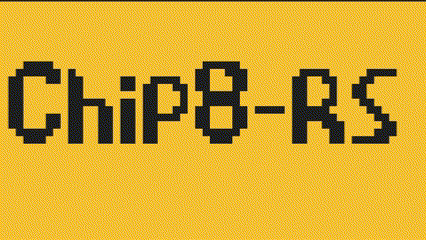

# CHIP-8 Emulator on the browser with WASM

## Features

### Debugger View and Stepping through code

### Variable speed

Yes it can even run at 1e+308 cycles per seconds if your computer can handle it

### Sound 🔊

### All the Chip 8 games you would need

- 1dcell
- 8ceattourny_d1
- 8ceattourny_d2
- 8ceattourny_d3
- BadKaiJuJu
- br8kout
- carbon8
- caveexplorer
- chipquarium
- chipwar
- danm8ku
- down8
- flightrunner
- fuse
- ghostEscape
- glitchGhost
- horseWorldOnline
- knumberknower
- masquer8
- mastermind
- mini-lights-out
- octoachip8story
- octojam1title
- octojam2title
- octojam3title
- octojam4title
- octojam5title
- octojam6title
- octojam7title
- octojam8title
- octojam9title
- octojam10title
- octorancher
- outlaw
- petdog
- piper
- pumpkindressup
- RPS
- slipperyslope
- snek
- spacejam
- spaceracer
- spockpaperscissors
- superpong
- tank
- tombstontipp
- wdl
- tests/1-chip8-1-chip8-logo
- tests/2-ibm-2-ibm-logo
- tests/3-corax3-corax+
- tests/4-flags
- tests/5-quirks
- tests/6-keypad
- tests/7-beep

All graciously taken from the [Chip 8 Archive](https://johnearnest.github.io/chip8Archive)

## Compile it yourself

1. Install [wasm-pack](https://github.com/rustwasm/wasm-pack)
2. Run `./build.sh`
3. Serve the `web/index.html` from a web server and enjoy!

## *WHY ALL IN RUST?

It's not completely in Rust... There is a lot of "glue" code that is generated by [wasm-bindgen](https://rustwasm.github.io/wasm-bindgen/) that generates a lot of the bindings between Rust and JS. However since all the source code is written in Rust. I'll count it as all in Rust.

This shows what is possible with just Rust (+ amazing glue tooling) and a few dependencies. The javascript included in this project only starts the wasm environment.

## Thanks

This couldn't have been possible without these amazing websites.

- The guide that started it all: [Guide to making a CHIP-8 emulator](https://tobiasvl.github.io/blog/write-a-chip-8-emulator/)
- The concrete guide that is great for writting better code: [Building a CHIP-8 Emulator [C++]](https://austinmorlan.com/posts/chip8_emulator/)
- Quick ref: [CHIP-8 Instruction Set](https://johnearnest.github.io/Octo/docs/chip8ref.pdf)
- The archive from the amazing John: [Chip-8 Archive](https://johnearnest.github.io/chip8Archive/)
- The very cool assembler: [Octo](https://johnearnest.github.io/Octo/)
- All the other awesome stuff: [Awesome Chip-8](https://github.com/tobiasvl/awesome-chip-8)

## TODO

- save breakpoints and actually stop on them
